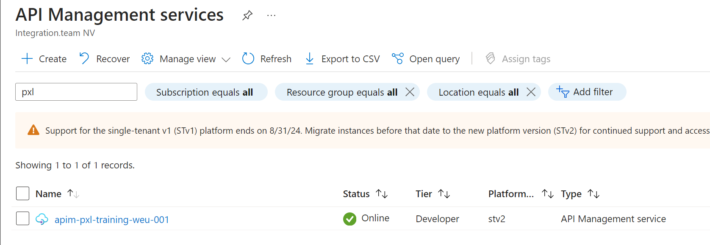
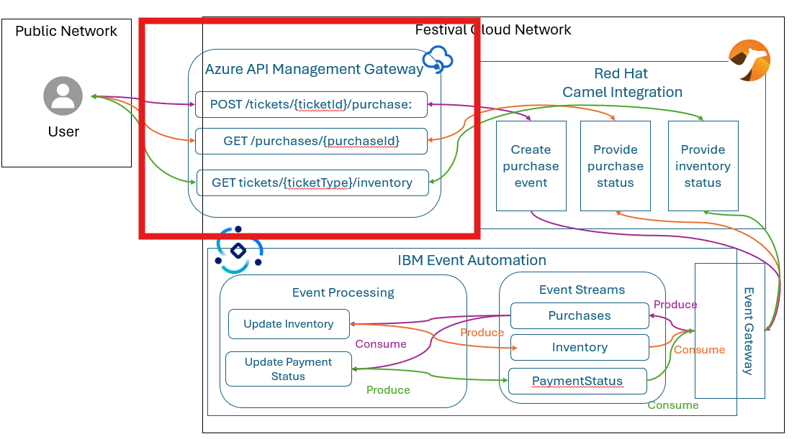

## Technical requirements

- Azure requirements
  - Access to the [Azure Portal](https://www.portal.azure.com)
  - Login in with the following credentials:
    - **Username**: `pxlstudentxx@integrationteamtesting.onmicrosoft.com`
    
  - The portal will ask to enter a Temporary Access Passcode (TAP). The TAP will be provided by your instructor.
     
   
 - Validate in the Azure portal if you have access to the Azure API Management service: **apim-pxl-training-weu-001**. Use the following steps to validate this:
    - Go to the Azure portal
    - Search for **API Management services**
    - Select the **apim-pxl-training-weu-001** service
     
    - If you don't have access to this service, please contact your instructor.  

- Software requirements
  - [Postman](https://www.postman.com/downloads/)
  
- During this lab, we will add the quarterly info API to our Azure API Management instance. 

The following APIs/website definition should be available:
  - [Festival Ticket Sales API](../../assets/openapispec/FestivalTicketSalesAPI-openapispec.json). For the backend URI use the API endpoint that was setup on Red Hat Camel during the first exercise. In case the API is not available, you can use the following URI: `TO DO: add URI of mock service`

