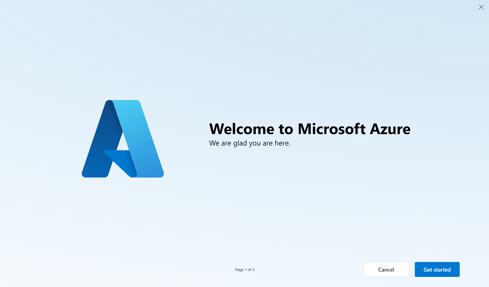

## Technical requirements

- Azure requirements
  - Access to the [Azure Portal](https://www.portal.azure.com)
  - Login in with the following credentials:
    - **Username**: `pxlstudentxx@integrationteamtesting.onmicrosoft.com`
    - **Password**: 'student123!'
  - 

   - During a first login, you will be asked to change your password. 
  - **Multi-factor authentication (MFA)** is enabled for this account. You will be asked to provide a phone number to receive a verification code. Use the option to skip this step for 14 days.
  - **Azure tour**: You will be asked to take a tour of the Azure portal. You can skip this step.
  
 - Validate in the Azure portal if you have access to the Azure API Management service: **apim-pxl-training-weu-001**. Use the following steps to validate this:
    - Go to the Azure portal
    - Search for **API Management services**
    - Select the **apim-pxl-training-weu-001** service
    - 
    - If you don't have access to this service, please contact your instructor.  

- Software requirements
  - [Postman](https://www.postman.com/downloads/)
  
- During this lab, we will add the quarterly info API to our Azure API Management instance. 

The following APIs/website definition should be available:
  - [Festival Ticket Sales API](../../assets/openapispec/FestivalTicketSalesAPI-openapispec.json). For the backend URI use the API endpoint that was setup on Red Hat Camel during the first exercise. In case the API is not available, you can use the following URI: `TO DO: add URI of mock service`

