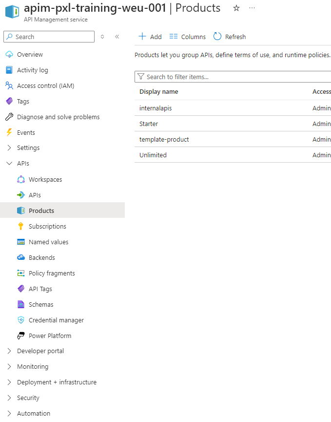
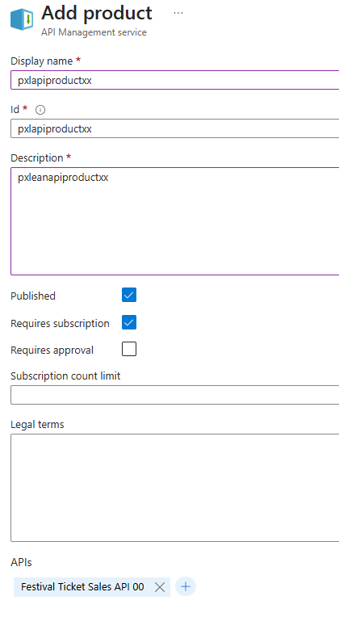
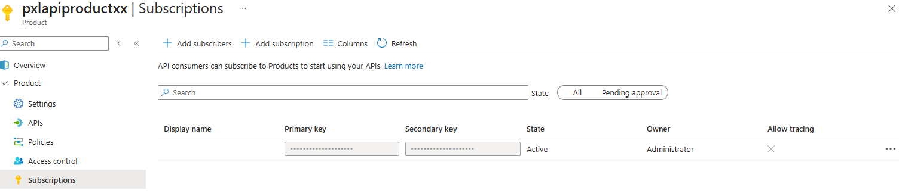
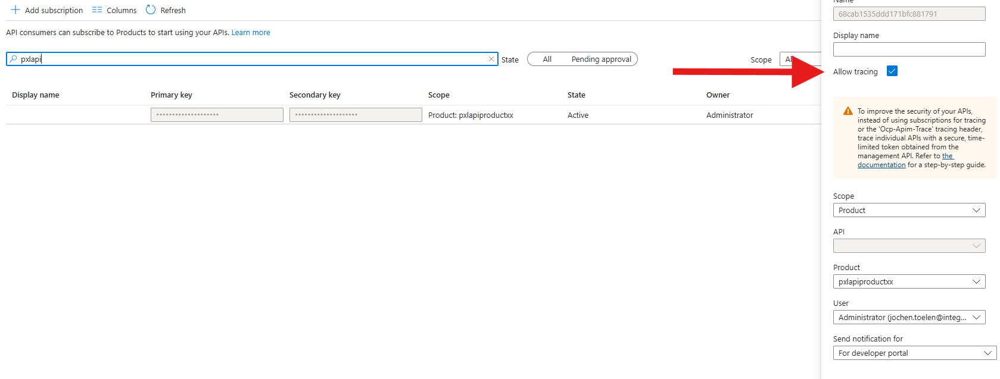
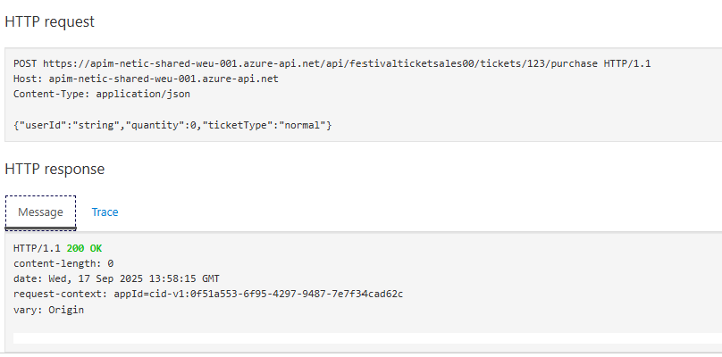
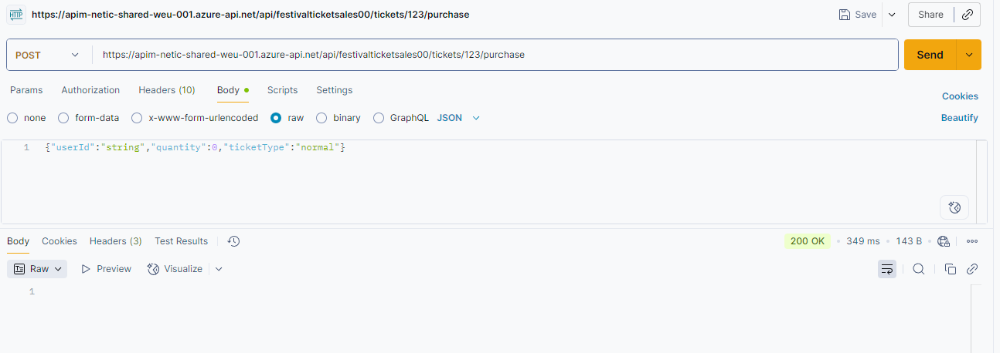

## Calling API and testing Subscription Keys
One way to secure your API is to require a subscription key or API key. This key is used to identify the calling application and to track the usage of the API. In this exercise, we will add a subscription key to the API and test it.

The first thing we will need to do is to create a product in Azure API Management. A product is a collection of APIs that you can publish to developers. You can configure the product to require a subscription key, and you can set rate limits on the product.

### Create a product
In the Azure portal go to your API Management instance and click on **Products** in the left-hand menu. Click on **Add product**.

  

1) Fill in the details for the product.

| Field                | Value                        |
|----------------------|------------------------------|
| **Display name**     | pxlapiproductxx              |
| **Id**               | pxlapiproductxx              |
| **Description**      | pxlapiproductxx  |
| **Published**        | True                         |
| **Requires subscription** | True                   |
| **Requires approval** | False                      |

Replace xx with your student number for this excercise.

2) Click on the '+' button next to **APIs** and select the **Festival Ticket Sales API xx** API. Click on **Add**.

  

3) Click on **Create** to create the product.

### Create a subscription
Next, we will create a subscription to the product. A subscription is a relationship between a developer and a product. It contains the subscription key that the developer will use to call the API.

1) Go to **Products** in the left-hand menu and click on the product you created.
2) Click on **Subscriptions** in the left-hand menu and then click on **+ Add subscription**.
3) Fill in the details for the subscription.
Name: pxlapisubscriptionxx
Display name: pxlapisubscriptionxx
Allow tracing: true (this will be used later in the exercise)
User: Leave empty



## Retrieve the subscription key
Now that we have created the subscription, we can retrieve the subscription key (api key) that is linked to the product.

1) Click on the subscription you created.
2) Click on **...** and select **Show/hide keys** to reveal the subscription key.
3) Copy the primary key and store it locally since it will be used later on during this excercise.
4) We will additionally also enable tracing for this subscription. Set the **Allow tracing** option to **true**. This will be used later in the exercise.


## Test the API
There are multiple ways to test an API in Azure API Management. One way is to use the **Test** tab in the Azure portal. This tab allows you to test the API operation by sending a request to the API and viewing the response.

### Test the API operation inside the Azure portal
1) Click on the **Test** tab.
2) Select the operation **POST /tickets/purchase**. Display name: '**Initiates a new ticket purchase**'
3) In the **Template parameters** section, enter the value for the required parameter **ticketId**. For this exercise, enter `123`.
4) In the **Request body** section, enter the following JSON object if it's not present already:

```json
{"userId":"string","quantity":0,"ticketType":"normal"}
```
5) Click on **Send** to send the request to the API.
6) The response will be displayed in the **Response body** section. The response should be the mock response that was added to the API operation.


### Test the API operation using Postman
Another way to test the API operation is to use a tool like Postman. Postman is a popular tool for testing APIs. It allows you to send requests to an API and view the response. You can download Postman from the following link: [Postman](https://www.postman.com/downloads/).

1) Open Postman.
2) Create a new request by clicking on the **New** button.
3) Enter the request URL. The request URL is the URL of the API operation. You can find the URL in the **Request URL** section of the **Test** tab in the Azure portal.
4) Select the **POST** method.
5) Click on the **Body** tab.
6) Select **raw** and **JSON** from the dropdown menu.
7) Enter the request body in the text area. The request body is the same as the request body that was entered in the **Request body** section of the **Test** tab in the Azure portal.
8) Add a new header with the key **Ocp-Apim-Subscription-Key** and the value of the subscription key you copied earlier.
9) Click on the **Send** button to send the request to the API.
10) The response will be displayed in the **Response** section. The response should be the mock response that was added to the API operation.

