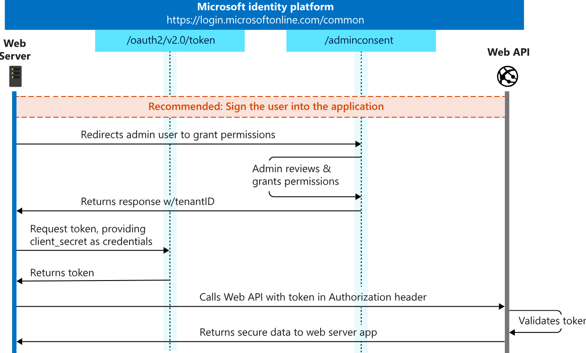
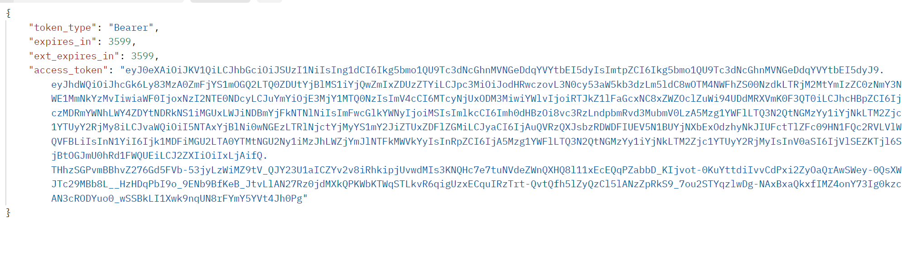
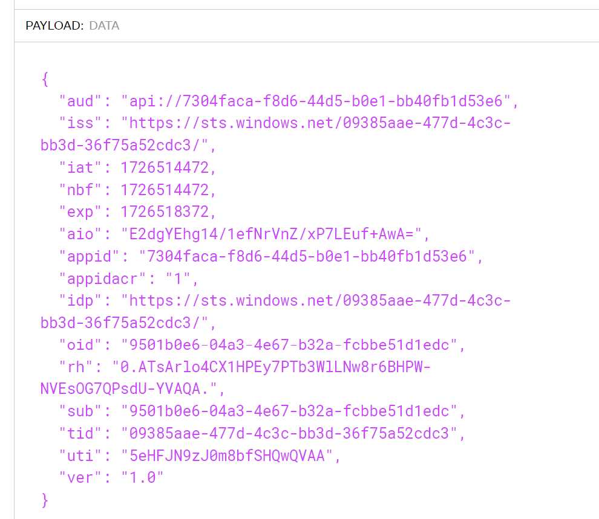

## JSON Web Tokens (JWT)

In this lab, we are going to see how we can protoct our API using JSON Web Tokens (JWT). We will create a JWT token and validate it in Azure API Management. 

JSON Web Tokens are an open-industry standard method for representing claims securely between two parties. More info at <https://jwt.io>. 

In order to protect our API we will use the OAuth 2.0 client credentials flow. This flow is used when the client application is acting on its own behalf. In this case, the client application will be our postman client. Our API will be protected by a JWT token that will be validated in Azure API Management.



### Generate a JWT Token in postman
1) Open Postman and create a new request.
2) Set the request type to POST.
3) Set the URL to `https://login.microsoftonline.com/yourtenantid/oauth2/v2.0/token` and replace `yourtenantid` with the tenantid mentioned below.
4) Go to the **Body** tab and select **x-www-form-urlencoded**.
5) Add the following key-value pairs:
   - `client_id` : `yourclientid` (replace `yourclientid` with the client id of your app registration)
   - `scope` : `api://yourapiid/.default` (replace `yourapiid` with the api id of your app registration)
   - `client_secret` : ask instructor
   - `grant_type` : `client_credentials`
6) Click on **Send** to get the JWT token.
7) The output should look like this:



For this exercise, we will use the following values:
- `client_id` : `7304faca-f8d6-44d5-b0e1-bb40fb1d53e6`
- `scope` : `api://7304faca-f8d6-44d5-b0e1-bb40fb1d53e6/.default`
- tenant id: `09385aae-477d-4c3c-bb3d-36f75a52cdc3`

### Inspect the JWT Token
The website <https://jwt.io> can be used to inspect the JWT token. Copy the token from the response and paste it into the website. You should see the header and payload of the JWT token.



The token payload contains the following information:
- `aud` : The audience of the token. This is the api id of the app registration.
- `iss` : The issuer of the token. This is the tenant id of the app registration.
- `exp` : The expiration time of the token.
- `appid` : The app id of the app registration.
- `idp` : The identity provider of the token.
- `sub` : The subject of the token.

### Add the JWT Token to the API Management

- Back in APIM, open the **Festival Ticket Sales API xx** API and select **All operations**.
- In the **Code View** add an inbound `validate-jwt` policy with the signing key.

  ```xml
    <validate-jwt header-name="Authorization" failed-validation-httpcode="401" failed-validation-error-message="Unauthorized. Access token is missing or invalid.">
    <openid-config url="https://login.microsoftonline.com/09385aae-477d-4c3c-bb3d-36f75a52cdc3/v2.0/.well-known/openid-configuration" />
    <audiences>
        <audience>{audience-value - (ex:api://guid)}</audience>
    </audiences>
    <issuers>
        <issuer>{issuer-value - (ex: https://sts.windows.net/{tenant id}/)}</issuer>
    </issuers>
    <required-claims>
        <claim name="idp">
            <value>{identity provider of the token}</value>
        </claim>
    </required-claims>
    </validate-jwt>
     <!-- Remove authorization header -->
    <set-header name="Authorization" exists-action="delete" />
    ```  
  Fill in above values with the values from the JWT token. 

- Open postman and send a request to the API with the JWT token in the Authorization header. The Authorization header should look like: 
    ```
    Authorization: Bearer ey...
    ```         
- You should get a `200` Success response.
- Use the APIM trace feature to inspect the request and response. You should see the `validate-jwt` policy in the inbound section.

