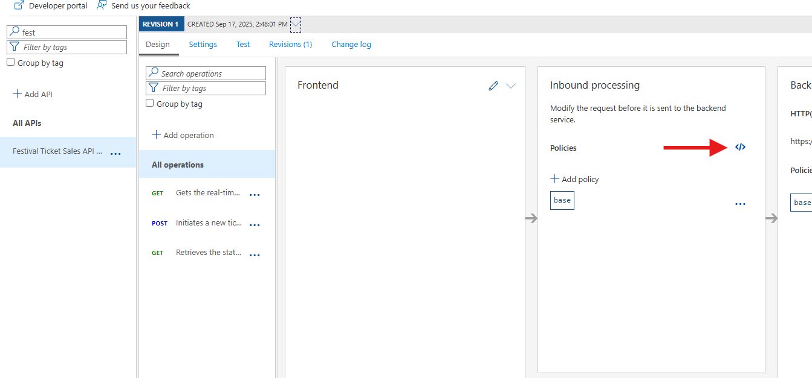

## Rate limiting
Rate limiting is a way to control the amount of incoming and outgoing traffic to or from an API. It is a common practice to prevent abuse of the API and to ensure that the API is available to all users. Rate limiting can be implemented in different ways, such as by IP address, user, or API key.

In this exercise, we will implement rate limiting in Azure API Management using the `rate-limit-by-key` policy. This policy allows you to limit the number of requests to an API based on a key, such as an API key or subscription key.

### Add rate limiting policy
In this exercise, we will add a rate limiting policy to the `POST /ean-consumptions` operation of the `Festival Ticket Sales API xx` API. The policy will limit the number of requests to 5 per minute per IP address.

1. Click on the **Festival Ticket Sales API xx** API.
2. Click on the operation **All operations**.
3. Go to the **Inbound processing** section and open **policy code editor**.
  
4. The XML editor will open. Add the following policy to the `<inbound>` section of the policy:
```xml
    <rate-limit-by-key calls="5" renewal-period="60" counter-key="@(context.Request.IpAddress)" />
```
5. Press **Save**.

### Test the rate limiting policy
In order to test the rate limiting policy, we will use Postman to send multiple requests to the API and view the response.

1. Open Postman.
2. Reuse the request you created in the previous exercise.
3. Send the request to the API multiple times within a minute.
4. After the 5th request, you should receive a `429 Too Many Requests` response from the API. This indicates that the rate limiting policy is working as expected.

