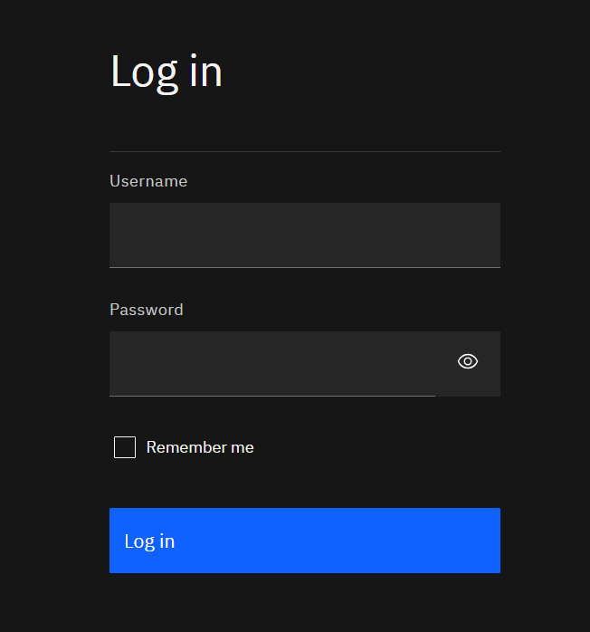
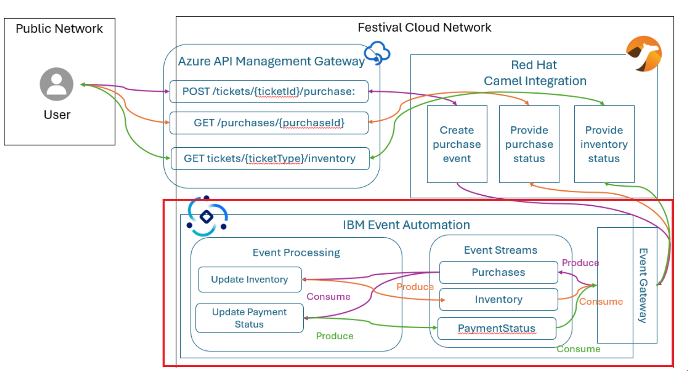

## Technical requirements

- IBM Event Automation (3 platforms)
  - [IBM Event Streams](https://es-demo-ibm-es-ui-tools.apps.itz-c8kjj5.infra01-lb.fra02.techzone.ibm.com)
  - [IBM Event Endpoint Management](https://eem-demo-mgr-ibm-eem-manager-tools.apps.itz-c8kjj5.infra01-lb.fra02.techzone.ibm.com)
  - [IBM Event Processing](https://ep-demo-ibm-ep-rt-tools.apps.itz-c8kjj5.infra01-lb.fra02.techzone.ibm.com)
 
You will find credentials to login in: [Credentials] (https://github.com/I8C/student-integration-project/blob/main/exercises/day3-event-automation/Assets/Users.txt) 
Take your account id as agreed during previous exercises. The credentials are the same for all 3 platforms.
  - Login in with the following credentials:
    - **Username**: `studentXX` +´`matching password`
    
	
As we are all using the same instance of IBM Event Automation, we will see the objects other students are creating. 
To avoid impact, you will use a prefix for each object you will create. 

	Account 	- Prefix
	Student01 	- ST01
	Student02	- ST02
	Student03 	- ST03
	Student04 	- ST02
	...
     
  
- During this lab, we will wirk with the Event Automation platform

