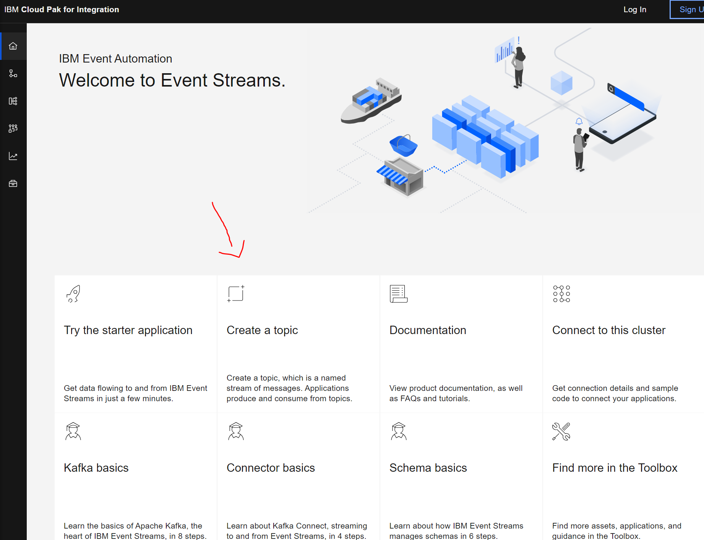
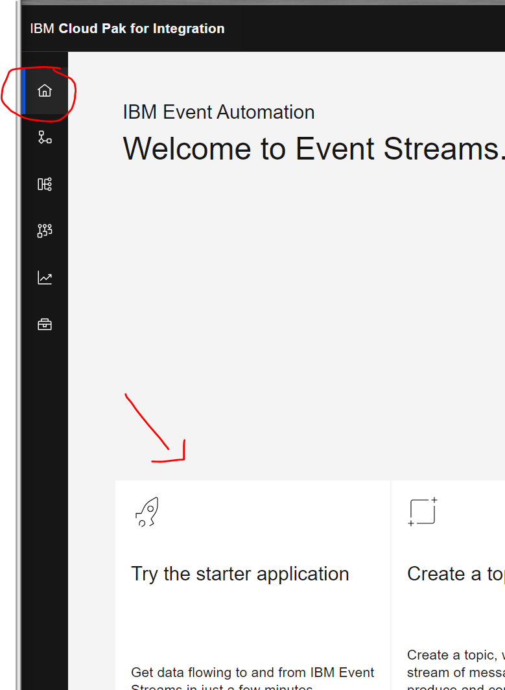

## IBM Event Streams
	- Login to IBM Event Streams
	- Click on 
	- Give a topic name. Example given: ST00-MY.FIRST.TOPIC
	- Other config can remain as is.
	- Create Topic

### Starter Application
The starter application is an easy way to test your topic. You will be able to publish events to the topic. And you will also be able to consume from the same topic.

	- Go back to the home Tab
	- Click on 
	- Download the Jar from github (demo-all.jar)
	- Click `Generate properties`  -> `Existing topic` -> Choose your newly create topic and download the zip
	- Plaze the zip properties into the same folder als the jar file and unzip them
	- Open a cli and navigate to the JAR file downloaded from GitHub, and run it
		-> java -Dproperties_path=<path-to-properties> -jar demo-all.jar
	- Open an webbrowser and browse to [localhoset:8080] (localhost:8080)
	- Try producing and consuming using the starter app.
	- Don't forget to stop producing your events
	
### Check Results in Event Streams
	- Login to IBM Event Streams
	- Go to the topic tab 
	- Open your new topic and verify if your events are coming in
	- Don't forget to stop producing your events