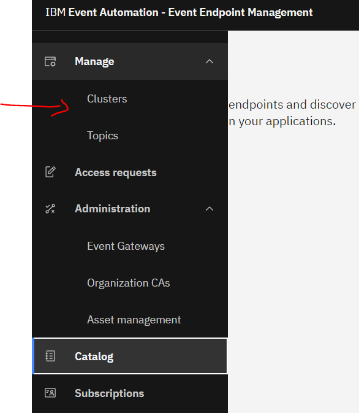
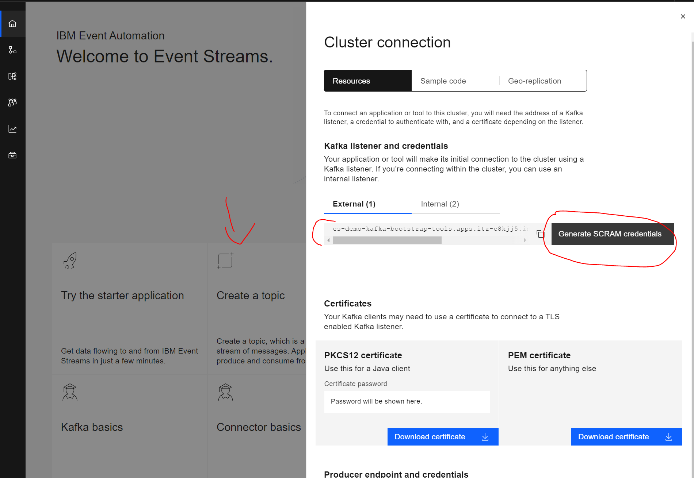
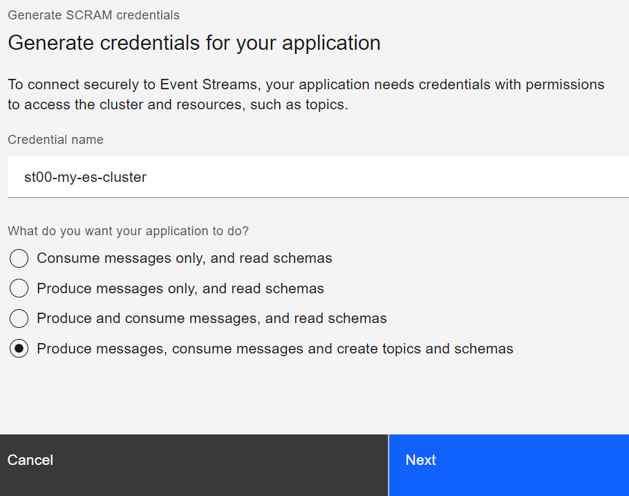
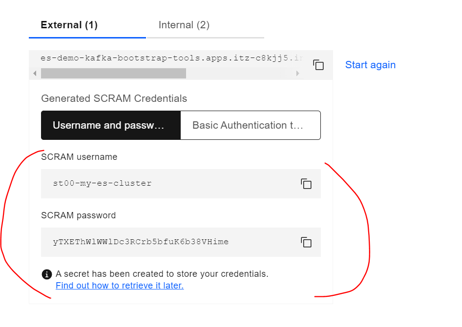
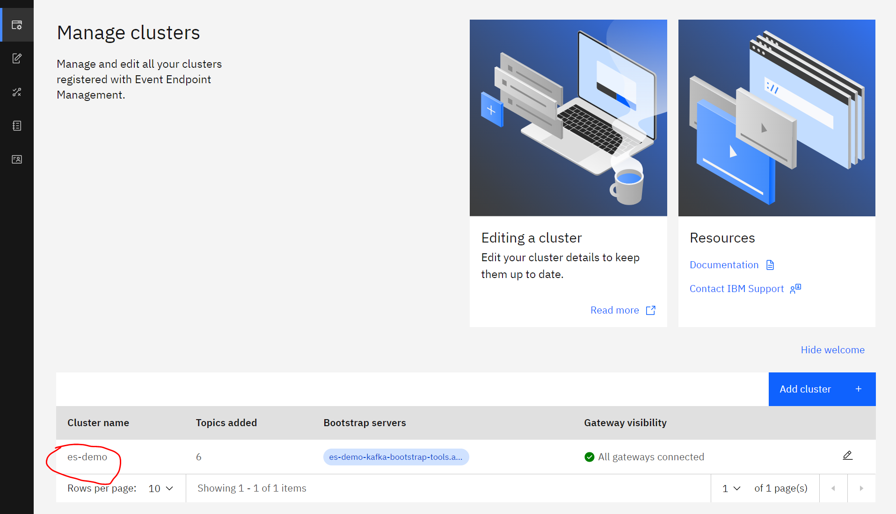
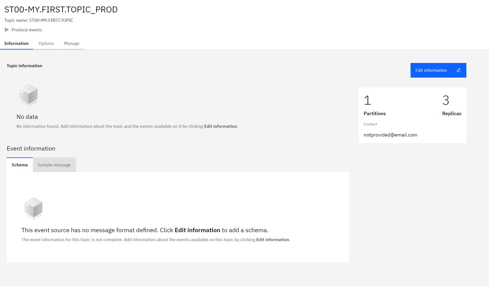
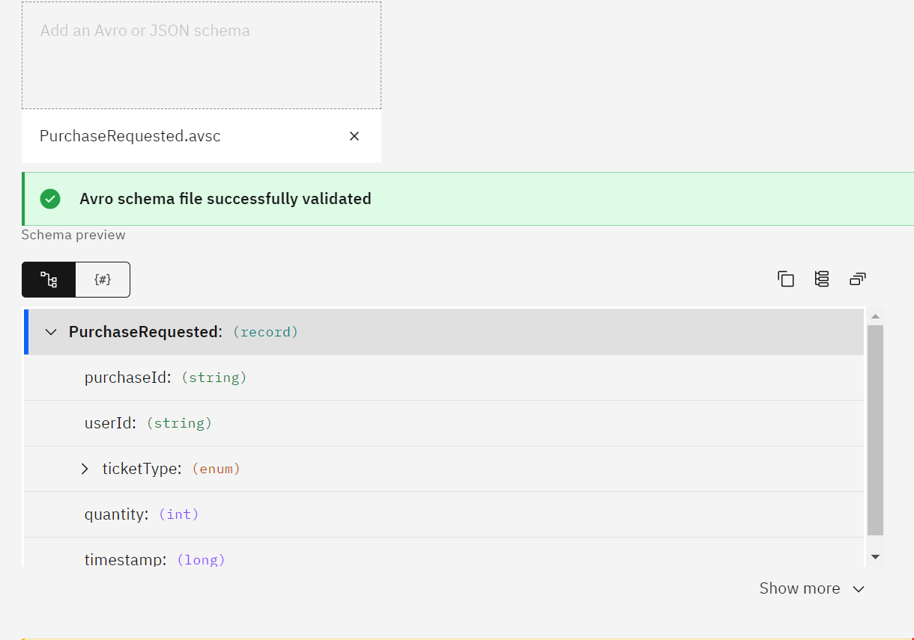

# Create the required objects for the PXL festival servcice
The next step is to create all the required topics for the festival service, secure them and expose these topics to the public world to be used.

## Create Topics
Keep in mind to use your student prefix when creating objects (ST01, ST02,...)
1. Create following topics using the same steps as you just created 'ST00-MY.FIRST.TOPIC':
	* ST00-TICKET.INVENTORY.UPDATED
	* ST00-TICKET.PAYMENT.STATUS.UPDATED
	* ST00-TICKET.PURCHASE.REQUESTED
	

## Connect your EEM with the ES cluster
When exposing topics to the outside (extern your team, domain, enterprise), you will want to do it secured and in a 
self-managed way. To do this, we will use Event Endpoint Management (EEM). This is as sort of app store for data streaming applications.

	- Login to 
[IBM Event Endpoint Management](https://eem-demo-mgr-ibm-eem-manager-tools.apps.itz-c8kjj5.infra01-lb.fra02.techzone.ibm.com)
	
	- Verify if you are already connected to a ES cluster 
	- Go to Manage -> clusters	

	- If the list contains a cluster, you are good to go and you can continue with the step "Add your topics to EEM"
	- If the list is empty, you will need to add the cluster to  your environment
	
### Add a new Cluster
##### IBM Event Streams
	- Get the cluster address from IBM Event Streams (tip: paste it in notepadd as you will also need to get the credentials 
	-> these can only be copied once!!!)

		
	- Generate Credentials

		
	- Produce messages, consume messages and create topics and schemas
	- All Topics
	- All Consumer Groups
	- All transactional IDs
	- Save your credentials

		
		
#### IBM Event Endpoint Management
In EEM, click add cluster and provide the saved information

	- Click "Add cluster"
	- Give the cluster a logical name: st00-my-es-cluster
	- If all is configure correctly, you should see something like:
	

	
### Add your topic to EEM
A topic in IBM Event Endpoint Management (EEM) has a different role and purpose as in IBM Event Streams(ES). 

	- In ES:
		* We refer to the core capability of event storage and messaging unit.
		* The main purpose is to provide a highly available and scalable log of events for producer to write 
		to and consumers to read from
	- In EEM:
		* We use topics to describe, catalog, secure and govern access to the kafka topics provided in ES
		* We enable self-service for developers
		* We provide AsyncAPI specs for developers
		* We allows an admin to define access, policies and plans
		
Also in EEM we make a difference between consuming events from a topic and producing events to a topic. Each type will always contain dedicated credentials!
Tip, store these credentials because you won't be able to request them again. When the credentials are lost, you will need to regenerate these credentials.

#### Create a produce topic in EEM
Now lets create a producing topic in EEM for STXX-TICKET.PURCHASE.REQUESTED

	- In EEm go to Manage Topics and create "Add Topic"
	- Click produce events
	- Ensure your cluster is selected
	- Select your topic (mind that you will see all topics available on the cluster)
	- Tip: Modify the Event source name and add the action to the name -> this allows us to also create consuming topics)
	e.g.: ST00-TICKET.PURCHASE.REQUESTED_PROD
	- When done: you should see your topic in the catalog
	
We still need to do come configuring before the topic is available for producing new events.

	- Go back to Manage topics and open your topic again
	- Browsing through the tabs, you will see it is rather empty

	
	- Click "Edit Information"
	- Here you can provide contact information for developers to use in case of questions
	- Go to Event Information
	- Lets add a event contract
[PurchaseRequested.avsc](https://github.com/I8C/student-integration-project/tree/main/exercises/day3-event-automation/Assets/Avro)

	- In the link you will find a contract you can download: PurchaseRequested.avsc
	- In EEM, drag and drop the contract in the appropriated box
	- If valid, you will see the structure of the contract

	- Change the message format to JSON
	- Add a Sample message: 
	
	{
	  "purchaseId": "f0e9d8c7-b6a5-4321-fedc-ba9876543210",
	  "userId": "1a2b3c4d-5e6f-7080-91a2-b3c4d5e6f708",
	  "ticketType": "vip",
	  "quantity": 2,
	  "timestamp": 1679059200000
	}
	
	- Save and verify your result.
	
#### Lets add some policies
Policies allow us to provide different forms of security. Here we will provide two types of policies: approval and schema enforcement

	- Go to the options tab
	- Create options
	- Give it a usefull name and alias: ST001-TICKET.PURCHASE.REQUESTED_PRODUCED
	- Click add control and add Approval
	- Click add control again and add Schema enforcement
	- Click Save
	- Click Publish
	
Now Developers will be able to discover your newly created topic. But they can't use it yet!

#### Create a subscription
	- Go to catalog (you are using an privileged user, so imagen you now are an application developer instead of a kafka administrator)
	- Browse to topic you need
	- Here a developer can find all required info: 
		* boorstrap server
		* certificates
		* avro contract
		* example message
		* Export an AsyncAPI (do download one and check what info it provides -> very usefull, just not for the exercise)
		* There even is a code example to help developers get started
	- Now click request access and fill in the form
	- Notice the request is pending
	
	- Now lets get back to administrating Kafka 
	- Go to access request and find your request
	- Click on View request and approve
	
	- Go back to the Catalog
	- Go to to your topic
	- Click subscribe
	- Download credentials -> you won't be able to download them again.
	
## Update Camel application
	- Now go to your Camel application and update your credentials with your new credentials
	- Go back to ES 
	- Open your topic and see your results comming in
	
### Nice extra
	- Try sending events which do not match the contract and see if they arrive in your topic on ES
	- Try the same thing when disabling the policy schema enforcement
	